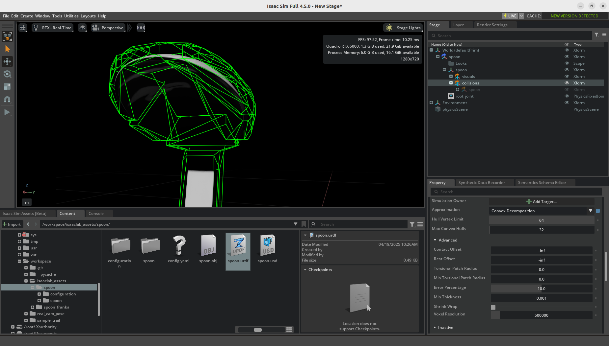
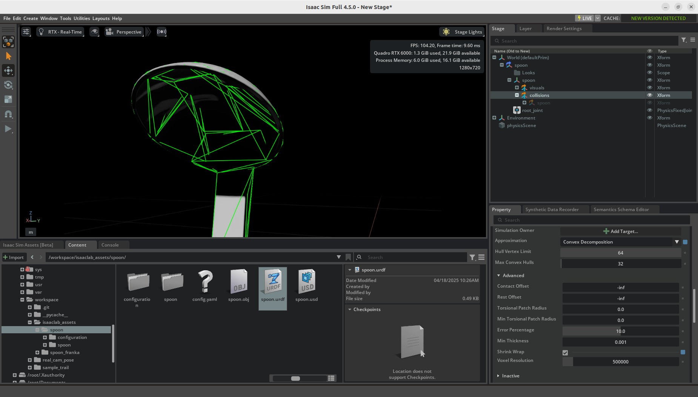
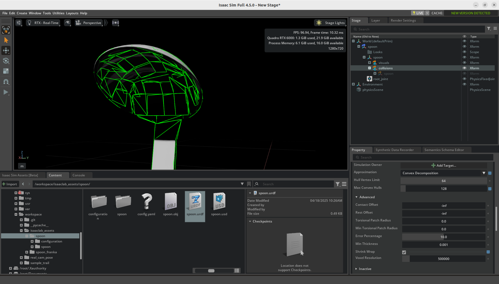

# Isaac Sim Discussions

This page contains paraphrased discussions that may be useful for future reference. Also note that these discussions are searchable from the search bar in the website.

For issues related to this page, please [open a GitHub issue](https://github.com/j3soon/robotics-notes/issues).

## Omniverse Launcher Deprecation

Q: How can I download Isaac Sim after the Omniverse Launcher deprecation?

A: You can directly download Isaac Sim binaries from [the Isaac Sim website](https://docs.isaacsim.omniverse.nvidia.com/latest/installation/download.html#download-isaac-sim-short). This is actually a good change for Isaac Sim users, because it allows Isaac Sim to be directly downloaded without using Omniverse Launcher, which previously requires logging in with a NVIDIA account. Alternatively, you can [install it with Pip](https://docs.isaacsim.omniverse.nvidia.com/latest/installation/install_python.html) or [pulling the docker image](https://docs.isaacsim.omniverse.nvidia.com/latest/installation/install_container.html).

Related:

- [Legacy Tools for Omniverse Launcher](https://developer.nvidia.com/omniverse/legacy-tools)

> 2025-02-27. Isaac Sim v4.5.0.

## GUI Mode in Isaac Sim Docker Container

Q: How can I run Isaac Sim in GUI mode in a Docker container?

A: See [docker-isaac-sim](docker-isaac-sim.md).

> 2025-02-28. Isaac Sim v4.5.0.

## GUI Mode in Ubuntu Server

Q: How can I run Isaac Sim in GUI mode on an Ubuntu server (non-desktop environment)?

A: You can use [WebRTC](https://docs.isaacsim.omniverse.nvidia.com/latest/installation/manual_livestream_clients.html) or desktop forwarding such as VNC. Make sure you have a stable internet connection between the server and the client. Otherwise, you may encounter latency (or lagging) issues.

> 2025-03-03. Isaac Sim v4.5.0.

## (Open Issue) Blurry Screen on RTX 50 Series GPUs

Q: The Isaac Sim GUI is blurry on my RTX 50 series GPU.

A: This is a known issue and should be fixed in the next release.

References:

- [The Isaac Sim GUI is blurry](https://forums.developer.nvidia.com/t/the-isaac-sim-gui-is-blurry/327759)
- [Isaac Sim Rendering Issue on RTX 50 series](https://forums.developer.nvidia.com/t/isaac-sim-rendering-issue-on-rtx-50-series/329300)

> 2025-04-08. Isaac Sim v4.5.0.

## Collision Mesh Fidelity

Q: How can I improve the fidelity of Isaac Sim's collision meshes?

A: Tune the parameters in `Property > Collider` of the object mesh. For an example:

| Step | Screenshot |
|------|------------|
| 1. Convex Decomposition |  |
| 2. Shrink Wrap |  |
| 3. Max Convex Hull |  |

Related:

- [How to programmatically apply Convex Decomposition with Shrink Wrap to match Isaac Sim UI defaults?](https://forums.developer.nvidia.com/t/how-to-programmatically-apply-convex-decomposition-with-shrink-wrap-to-match-isaac-sim-ui-defaults/310338)
- [Collision Settings \| Omniverse Extensions](https://docs.omniverse.nvidia.com/extensions/latest/ext_physics/rigid-bodies.html#collision-settings)

> 2025-04-14. Isaac Sim v4.5.0.
